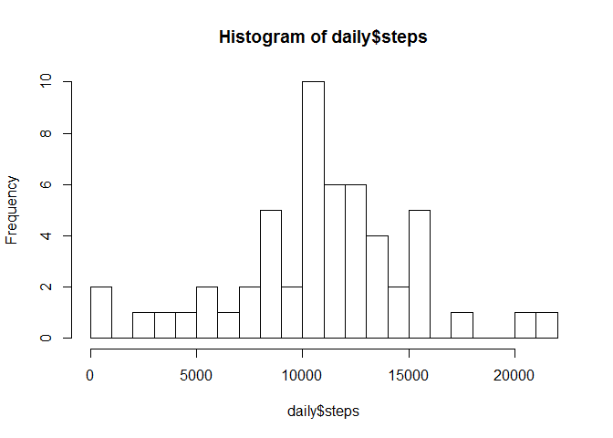
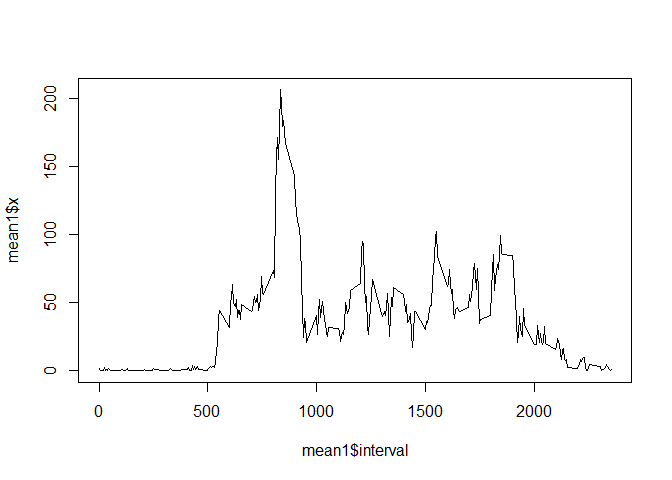
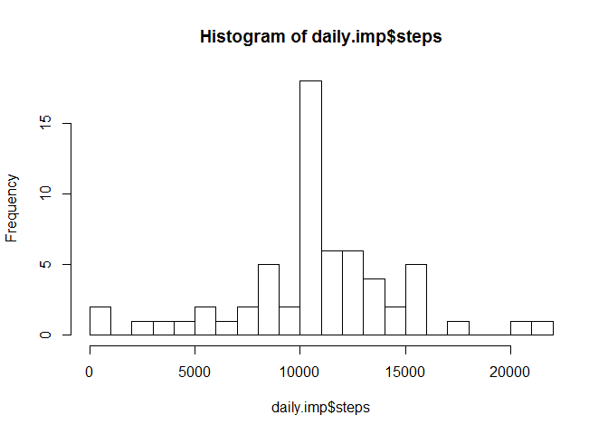
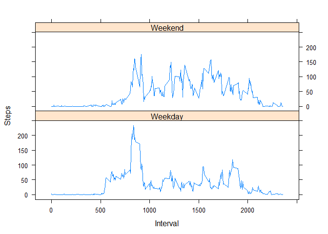

# Reproducible Research: Peer Assessment 1


## Loading and preprocessing the data
We load the data and and format the date column as date types


```r
archive=read.csv('activity.csv')
archive$date=as.Date(archive$date)
```


## What is mean total number of steps taken per day?
We use aggregate to get the sum of steps by dates. We then plot it on a histogram.

```r
daily<-aggregate(steps ~ date, archive, sum)
hist(daily$steps, breaks=20)
```

\
Summary shows the mean:10770, median:10760

```r
summary(daily$steps)
```

```
##    Min. 1st Qu.  Median    Mean 3rd Qu.    Max. 
##      41    8841   10760   10770   13290   21190
```

## What is the average daily activity pattern?
We aggregate steps by the interval times. A time series plots show us the activity pattern which peaks in the morning and die off after 9pm

```r
mean1 <- aggregate(archive$steps, 
                                by = list(interval = archive$interval),
                                FUN=mean, na.rm=TRUE)
plot(mean1$interval,mean1$x, type = "l")
lines(mean1$interval,mean1$x)
```

\
Max interval is found at 8:35

```r
mean1[which.max(mean1$x),]
```

```
##     interval        x
## 104      835 206.1698
```

## Imputing missing values
2304 missing values in the data frame

```r
sum(is.na(archive))
```

```
## [1] 2304
```
THe missing value is imputed by replacing with mean steps of the particular interval. A new histogram shows slight changes from the original.

```r
averages <- aggregate(steps ~ interval, data = archive, mean)
fill <- numeric()
for (i in 1:nrow(archive)) {

  if (is.na(archive[i, ]$steps)) {
    step <- subset(averages, interval == archive[i, ]$interval)$steps
  } else {
    step <- archive[i, ]$steps
  }
  fill <- c(fill, step)
}

archive.imp <- archive
archive.imp$steps <- fill

daily.imp<-aggregate(steps ~ date, archive.imp, sum)
daily.imp$date<-as.Date(daily.imp$date)
hist(daily.imp$steps, breaks=20)
```

\

```
Summary shows the mean:10770, median:10770
imputing with mean caused the median to shift up to match the mean.

```r
summary(daily.imp$steps)
```

```
##    Min. 1st Qu.  Median    Mean 3rd Qu.    Max. 
##      41    9819   10770   10770   12810   21190
```

## Are there differences in activity patterns between weekdays and weekends?
We create a new column seperating weekday and weekend dates using the weedays function. A new data frame is created.

```r
day <- weekdays(as.Date(archive$date, "%Y-%m-%d"))
daytype <- vector()
for (i in 1:nrow(archive)) {
  if (day[i] == "Saturday" |day[i] == "Sunday") {
    daytype[i] <- "Weekend"
  } else {
    daytype[i] <- "Weekday"
  }
}
archive$daytype <- daytype
archive$daytype <- factor(archive$daytype)

stepsDayType <- aggregate(steps ~ interval + daytype, data = archive, mean)
names(stepsDayType) <- c("interval", "daytype", "steps")
```
Panel plot is created.

```r
library(lattice)
xyplot(steps ~ interval | daytype, stepsDayType, type = "l", layout = c(1, 2), 
       xlab = "Interval", ylab = "Steps")
```

\
It is evident that weekend patterns did not have the dramatic peak int the morning as weekdays. The weekends also start slower.
